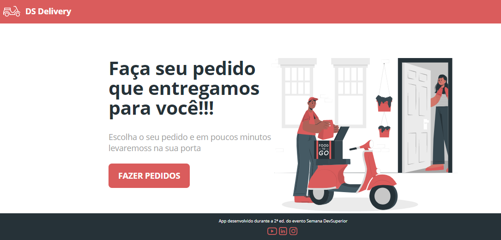
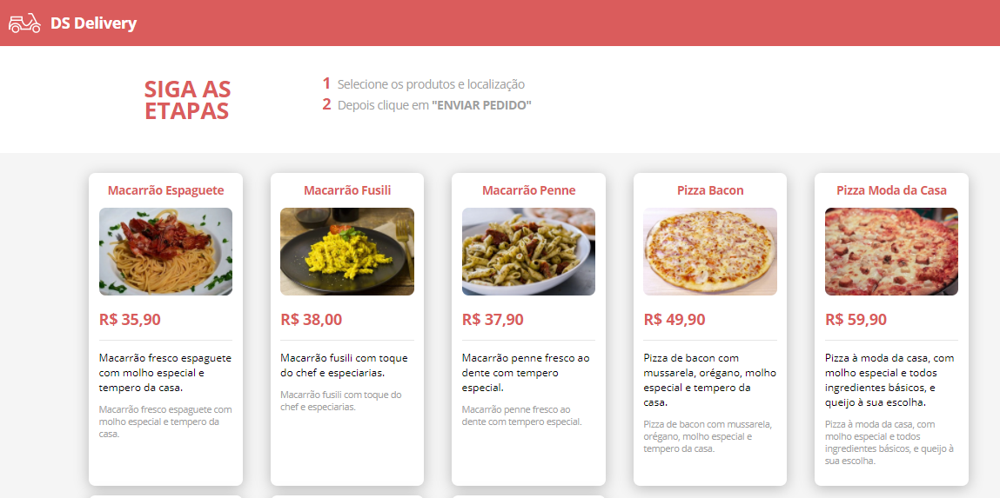
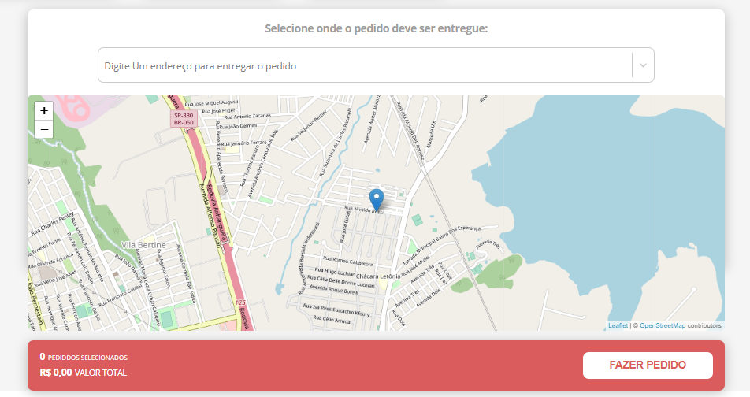

# SEMANA DEV-SUPERIOR PROJETO DS-DELIVER  

<h1 align="center">
  
</h1>

<h1 align="center">
  
</h1>

<h1 align="center">
  
</h1>

### 🛠 Tecnologias usadas no projeto

<a href="https://www.java.com/pt-BR" target="_blank">Java</a>

- [Java](https://www.java.com/pt-BR" target="_blank)
- [Spring](https://spring.io/)
- [React](https://pt-br.reactjs.org/)
- [TypeScript](https://www.typescriptlang.org/)
